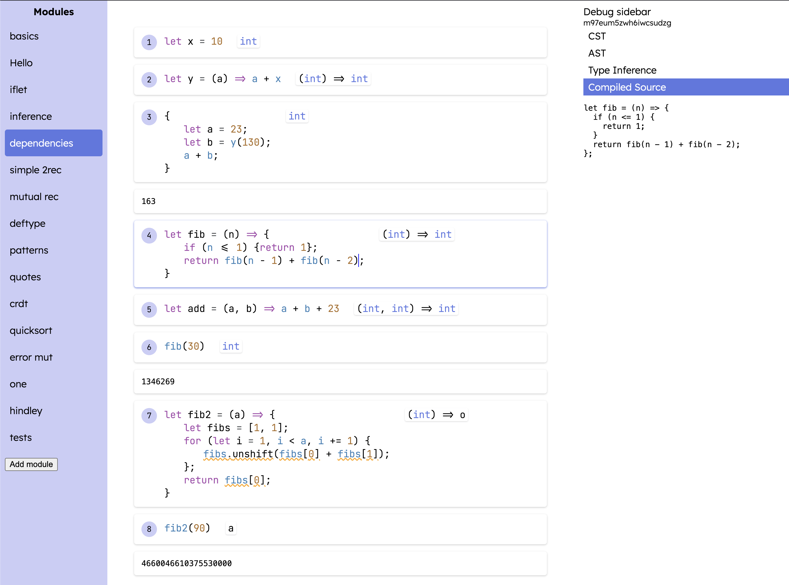

# Kipos

> Let a million languages bloom

Kipos is:
- from κήπος, greek for "garden".
- the language (development environment) for building the language you always wanted to use.
- a playground for experimenting with new type system, compiler, and syntax features.
- my attempt to advance the state of the art of programming language design.

## How to get started

- `pnpm i`
- `cd one-world/sandbox; bun serve.ts`

and it should be somewhat usable? no promises though.

## Current status (4/7/25)

- [x] basic structured editing UI/UX
- [x] basic parsing, type inference, compilation, and evaluation of a "ground-level" language (it's javascript with a little sugar)
- [x] basic fixture testing support
- [x] debug sidebar for inspecting: the CST, the AST, the Type Inference (stepping debugger), and the output compiled javascript

Next up:

- [ ] macros and modules
- [ ] ffi
- [ ] custom ADTs in the ground-level language
- [ ] maybe submodules
